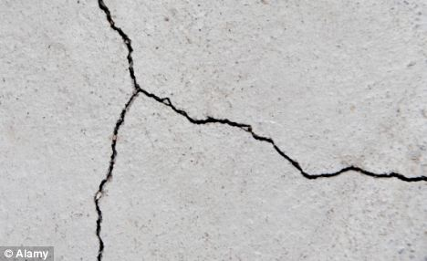

# C++ Crack Detection code using Raspiberry Pi Camera  

C++ code based on OpenCV library capable of detecting cracks utilizing a Raspberry Pi 3, Pi Camera and Raspicam Library  

Raspicam Library is available [here](https://github.com/cedricve/raspicam)  

When compiling the .cpp file please use:  

```
g++ *** -o *** $(pkg-config --cflags --libs opencv) -I/usr/local/include -L/opt/vc/lib -lraspicam -lmmal -lmmal_core -lmmal_util -lraspicam_cv
```

# Usage example

## Original image



## Final image


## Conclusion

After using the code, the image matrix will have only two possible values, according to the parameters set on the code. By running through this matrix, you can verify if some point is actually a crack on the surface or not.
